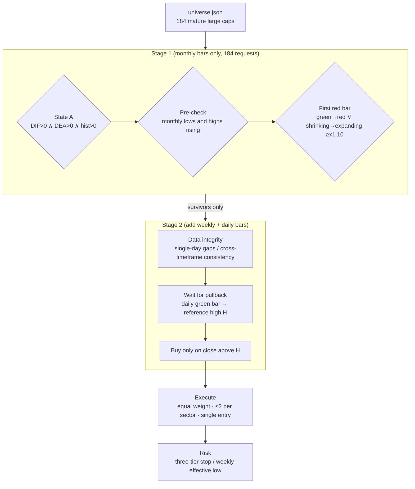

# holdle-screener

A trend-following methodology — *pick well → wait well → manage well* — written as code that
runs, that you can test, and that leaves a record you can review afterwards. It trades an
Alpaca paper account.

To be clear up front: this is a rule-verification tool. It is not investment advice and it is
not a profitable strategy. I guarantee nothing. Read "Known limitations" before you use it.


---

## 30 seconds

```bash
git clone git@github.com:Simen-Chen/holdle-screener.git
cd holdle-screener
python rules.py && python simtest.py && python screen.py --selftest
# -> 27 passed / 0 failed
# -> 70 passed / 0 failed
# -> 28 passed / 0 failed
```

No API keys, no network. Confirm the logic holds up first, worry about data later.

---

## What this is

An end-of-day US equity system. Monthly bars set the direction, daily bars pick the entry,
and rules handle everything after that.

Stock selection starts from a pool of 184 mature large caps in `universe.json`, grouped into
11 GICS sectors.

Timing is a three-gate entry: monthly State A, a structural pre-check on the monthly candles,
and a "first red bar". All three have to hold before anything happens. Then it waits for a
breakout above the prior swing high.

Risk is handled with a three-tier stop, a weekly effective-low exit, a two-positions-per-sector
cap, equal weight, and a single entry per name.

Three things make this worth more than yet another golden-cross bot:

Rules live outside the code. MACD periods, thresholds, stop levels, lookback lengths — all of
it sits in `config.json`. Change the rules by editing config, not source.

The tests need no network. 141 assertions, and `python simtest.py` finishes in seconds. The
indicator math is also cross-checked against external reference values, so I know the MACD it
computes matches what everyone else computes.

Failure modes are handled explicitly. Adjustment mismatches, stale signals from delisted
tickers, corrupted data while holding a position, entry opportunities that were already
consumed — each one has a gate and a regression test behind it. More on those below.

## What this is not

Not a live trading tool. `TradingClient(paper=True)` is hard-coded, so it is physically
impossible to route an order to a live account.

Not a complete implementation. The methodology's six-factor fundamental screen (ROE, gross
margin, net margin, cash ratio, EPS) is not in here. Stock selection is approximated by a
hand-picked pool of mature companies rather than computed from financials. That is the biggest
gap by far.

And it is not guaranteed to beat the market. The SPY benchmark comparison is built in
precisely so the system cannot fool itself.

---

## Quickstart

No keys, no network. Run these three first:

```bash
git clone git@github.com:Simen-Chen/holdle-screener.git
cd holdle-screener

# Indicator and rule self-test: 27 assertions, zero dependencies
python rules.py

# Offline end-to-end drill: 70 assertions, includes the decision truth table
python simtest.py

# Screener logic self-test: 28 assertions, zero dependencies
python screen.py --selftest
```

Once all three are green, connect real data:

```bash
cp config.example.json config.json
python -m pip install -r requirements.txt

# Prints where the keys were read from, never the keys themselves
python alpaca_io.py

# Dry run: decisions and plans only, no orders, no config writes
python run.py scan

# Screen the broad universe, read-only
python screen.py
```

<details>
<summary>What the real output looks like</summary>

```
$ python simtest.py
── Part 1 · 决策真值表 ──
  ✅ 状态A + 前置校验 + 第一根红柱 → ARM（等待突破）
  ✅ 无信号 → 不动作
  ...
演练结果：70 通过 / 0 失败
```

```
$ python screen.py
# 选股扫描报告 · 2026-09-21

> 候选池 184 只 ｜ 网络请求 202 次 ｜ 趋势跟随体系 ｜ 池子：`universe.json`

## 一、漏斗
| 环节 | 判据 | 通过 |
|---|---|---|
| 候选池 | `universe.json` | 184 |
| ① 状态A | 月线 DIF>0 ∧ DEA>0 ∧ 柱>0 | 87 |
| ② 前置校验 | 月K低点逐月抬高 ∧ 高点逐月抬高 | 42 |
| ③ 第一根红柱 | 由绿转红 ∨ 由矮变高（≥上月×1.10） | 41 |
| 闸门过了但不可交易 | 失效期已过 / 数据体检不过 | −3 |
| 入场闸门 | ①∧②∧③ 且仍有效 | 6 |
```

The funnel narrowing as it goes down is expected. Monthly-level signals are rare, and most of
the time the correct position is no position.

</details>

---

## How it works



### Key concepts

| Concept | Definition |
|---|---|
| State A | Monthly MACD: `DIF > 0 ∧ DEA > 0 ∧ histogram > 0` (histogram = 2×(DIF−DEA)) |
| Pre-check | Monthly lows rising and monthly highs rising. A downtrending monthly chart is rejected outright |
| First red bar | Scenario 1, "green to red": last month's histogram < 0 and this month's > 0. Scenario 2, "shrinking to expanding": after months of contraction, this month's histogram > last month's × 1.10 |
| Entry gate | State A, pre-check, and first red bar — all three |
| Reference high H | From the next month on, switch to daily bars. Wait for a pullback with a daily green bar, then take the first local high inside the entry window that has a real pullback with a green bar during it |
| Buy trigger | Close above H. Void if not broken within 60 days |
| Three-tier stop | Entry price P×0.80; once up more than 20%, move to P×0.90; once up more than 30%, move to P (breakeven). After that, the weekly effective-low rule takes over |

### Code to rule mapping

`rules.py` is the pure-function layer — zero dependencies, self-testable on its own.
`engine.py` is the orchestration layer.

| Code | Rule |
|---|---|
| `rules.is_state_a()` | State A |
| `rules.precheck()` | Monthly lows and highs rising |
| `rules.recent_first_red_bar()` | First red bar, both scenarios plus the ×1.10 threshold |
| `rules.find_reference_high()` | Reference high H |
| `rules.stop_line()` | Three-tier stop |
| `rules.weekly_effective_low()` | Weekly effective low |
| `engine.decide()` | Decision truth table: ARM / BUY / CANCEL / SKIP / HOLD / SELL |
| `engine._sector_count()` / `_size_order()` | Sector cap / equal weight |
| `engine.analyze()` | Data integrity check plus full analysis |

---

## Where everything lives

```
holdle-screener/
├── config.example.json    Parameter template, copy to config.json
├── universe.json          184-ticker pool, 11 GICS sectors
├── rules.py               Pure functions: indicators and criteria, 27 self-tests
├── engine.py              Main flow: scan → decide → execute → record
├── alpaca_io.py           Alpaca data and paper trading, keys from env only
├── screen.py              Broad-universe screener, two stages, 28 self-tests
├── run.py                 CLI entry point
├── report.py              Performance report: return / benchmark / max drawdown
├── audit_h.py             Reference-high auditing tool
├── simtest.py             Offline end-to-end drill, 70 assertions
├── verify_vs_reference.py Indicator cross-check, 16 assertions
└── docs/
    └── methodology.md     Full methodology write-up (Chinese)
```

Running it produces these:

| Path | Content |
|---|---|
| `ledger/YYYY-MM-DD.md` | Daily action log |
| `ledger/trades.jsonl` | Full action stream, one JSON per line, good for post-mortems |
| `state/portfolio.json` | Positions, pending entries, re-entry counters — the system's memory |
| `screens/YYYY-MM-DD.md` | Screener report |

---

## Configuration

`config.json` is the only file you need to touch. Change parameters, not code.

```jsonc
{
  "mode": "dry",              // dry=plans only / paper=Alpaca paper / live=disabled
  "mandate": {
    "start": "2026-09-16",    // autonomous trading window
    "end":   "2026-10-16",
    "benchmark": "SPY"        // SPY, not QQQ — don't give yourself a volatile benchmark to hide behind
  },
  "account": {
    "num_positions": 5,       // capital ÷ 5 = per-name allocation
    "same_sector_max": 2      // at most 2 per sector
  },
  "rules": {
    "macd_fast": 12, "macd_slow": 26, "macd_signal": 9,
    "scenario2_multiplier": 1.1,        // "shrinking to expanding" threshold
    "breakout_deadline_days": 60,       // void if not broken
    "stop_loss_1": 0.8, "stop_loss_2": 0.9, "stop_loss_3": 1.0
  },
  "watchlist": []             // leave empty; screen.py --apply fills it
}
```

### Keys

No key ever goes into a file. They are read from environment variables, with a fallback to
the Windows per-user registry.

```bash
setx ALPACA_API_KEY    "your Paper Key"
setx ALPACA_SECRET_KEY "your Paper Secret"
# reopen the terminal for this to take effect
python alpaca_io.py   # prints the source, not the key
```

Why the second layer: `setx` writes to the registry, and only processes started after it
inherit the value. A scheduled task launched by a long-running parent that started earlier
won't see it — and the result is a silent failure every morning with zero trades. I hit this
for real.

---

## Tests

| Suite | Assertions | Needs network | Covers |
|---|---|---|---|
| `python rules.py` | 27 | No | MACD convention, State A, pre-check, first red bar, stops, H window boundary |
| `python simtest.py` | 70 | No | Decision truth table, full pipeline, state persistence, data integrity, report gate, benchmark and drawdown, consumed entries, H sourcing |
| `python screen.py --selftest` | 28 | No | Screening consistency, deadline boundaries, delisting detection, watchlist safety, sector alignment |
| `python verify_vs_reference.py` | 16 | Yes | Engine MACD and first-red-bar against external reference values |

Why the effort: bugs in this class of system are mostly silent. Nothing errors, it just stops
working, or quietly buys one extra time. Without assertions, all you notice is that signals
seem to have dried up.

---

## Known limitations

Treat this as unfinished.

1. The weekly effective low is an approximation. The original rule is "pullback green weekly bar, then a new high → that low becomes the reference". The code approximates it with a swing-low window, three weeks either side by default. A few percentage points of drift is possible in extreme conditions.
2. Fills are approximated by the latest close. No slippage, no spread, no pre- or post-market. Paper results do not represent live results.
3. MACD needs warm-up. EMAs need dozens of periods to converge. Default lookback is 60 monthly bars.
4. Signal lookback is 4 months. Monthly indicators update once a month, so checking only the latest bar misses signals. Anything older than 4 months won't trigger.
5. Sector classification is a static table. Hand-maintained, and it won't follow GICS changes.
6. No fundamental screening. This is the biggest gap. The six financial factors aren't implemented; selection is approximated by a curated pool.
7. Adjustment is the biggest data trap. Alpaca returns unadjusted prices by default (`adjustment='raw'`). I hit this: a 10:1 split gave KLAC a fake monthly cliff from 1922.91 to 301.49, producing a histogram of −303 when the real value was +8.41. AVGO had an unadjusted weekly series sitting next to an adjusted monthly one — same stock, two timeframes, two conventions. The code now requests `Adjustment.ALL` explicitly, tags caches with the convention, and invalidates stale caches when it changes.
8. The pre-check lookback is an interpretive choice. It compares 3 complete months by default, ignoring the current month when incomplete. That value was calibrated once; going stricter conflicts with conclusions I'd already delivered.
9. IEX data feed. The free tier defaults to IEX. Volume and extreme prices may differ from the consolidated tape.
10. Needs a machine that stays on to run scheduled tasks.
11. Taking the first qualifying high for H is also an interpretive choice. The source material only says "wait for price to spike, forming a short-term high H" — it doesn't say first or highest. The current implementation takes the first one that qualifies. If you think it should be the window's highest, the change point is a single function, `rules.find_reference_high()`.
12. Parameters are calibrated, not optimized. I didn't run a parameter search and don't recommend one. Monthly signals are rare; overfitting is meaningless here.

---

## Design war stories

I think this is the most valuable part of the repository. Every item below was hit for real
and is locked down by a regression test.

### The silent no-op: reference high eaten by a window boundary

`find_reference_high()` used to start scanning for local highs at `start_idx + window`, which
effectively declared that the first 5 bars of the entry window could never be the reference
high.

But the spike most often happens right at the start of the month after the signal. That is
exactly where fresh money enters.

The result: for one ticker the window's highest point fell on bar 3 and was permanently
skipped, and no later local high exceeded it. The system then displayed "waiting for a spike"
and idled silently until the deadline. No error, no action.

The fix truncates the comparison window at the left boundary, instead of mistaking the entry
window's boundary for the data's boundary:

```python
lo = max(start_idx, i - window)   # no longer requires i >= start_idx + window
hi = min(n, i + window + 1)
```

I verified it afterwards against the methodology's own reference case: the computed H matched
the documented value exactly.

### Buying on a stale snapshot

`decide()` used to read `h_price` from state — a snapshot written on the day the signal was
armed. Any change to the algorithm or the data convention turns it into a stale value.

The result: with old H=109.56 and new H=110.69, a price landing between the two would make the
system buy without a genuine breakout of the prior high. No error, just one extra silent buy.

It now uses the value computed in the current run, with state as a fallback only.

### Beautiful signals from delisted tickers

An acquired, delisted company's monthly bars stop at the delisting month, but the "last 4
bars" still contain a perfect first red bar. The screener cheerfully reports it as a buy
point while you stare at a ticker you can't look up.

`is_stale()` exists to catch that.

### The entry opportunity was already consumed

The screener scans hundreds of tickers with a 4-month lookback, so it easily picks up names
that broke above H weeks ago and have since fallen back. If the system still waits for "a
breakout above H", it is actually waiting for the second breakout, which is not a valid entry
in this methodology.

`h_broken_date` records whether the close ever exceeded H between H's formation and today.

Why SKIP even when price is still above H: we weren't present on the breakout day, so we
cannot know how far the move already went. Price might be 1% above H, or it might have run to
+30% and come back to +1%. Buying in those two cases is completely different, and the data
cannot tell them apart. Can't distinguish, don't act.

### Corrupted data must not trigger trades

There are two integrity checks: single-day gaps (±50%) and cross-timeframe consistency (5%).
If either fails, the ticker is excluded from all decisions this run.

One design choice matters here: corrupted data plus a position that would trigger a stop still
does not sell. Better to stand still than to act wrongly; wait for the data to recover. A
dedicated test locks this down.

Gaps are judged on daily bars only, never monthly. A −39% monthly bar can be a genuine
gradual decline, and judging on monthly would kill real signals.

### Reports must show the real criterion

A report column once showed "entry gate" based only on whether the signal month had passed,
which produced the misleading display "pre-check failed, but gate shows open".

Entering the entry period is a temporal concept. It does not mean an entry is allowed. The
report has to use the real `gate_ok`. Another one locked down by a test.

---

## Roadmap

- The fundamental screening layer, i.e. the biggest gap. Wire up financial data and implement ROE, gross margin, net margin, cash ratio and EPS screening
- An exact weekly effective-low implementation to replace the window approximation
- A fuller backtesting framework. Right now there's cross-validation against reference values but no long-horizon historical backtest
- Multi-market and multi-universe support
- Parameter sensitivity analysis. Not optimization — checking whether results collapse when parameters move

## Contributing

Issues and PRs welcome. What I'd most like to see:

- Deviations between the implementation and the source methodology. This is the most valuable kind of report
- Additional edge-case tests
- Adapters for non-Alpaca market data
- Documentation fixes

Before opening a PR, make sure `python rules.py && python simtest.py && python screen.py --selftest` is all green.

## License

MIT, see [LICENSE](LICENSE). Full copyright, attribution, trademark and disclaimer terms are
in [NOTICE.md](NOTICE.md) — worth reading before you redistribute.

The methodology comes from the HOLDLE public course, and copyright in it belongs to its
original author. This repository is an independent implementation: not affiliated with, not
cooperating with, and not endorsed by the original author. The name in the repository title is
used only to identify which rule set is being implemented. No course text, slides, videos or
media are included.

If a rights holder believes the name or content exceeds fair reference, open an issue and I'll
rename or remove it.

---

*For learning and rule verification only. Not investment advice. Markets carry risk; decide carefully.*
