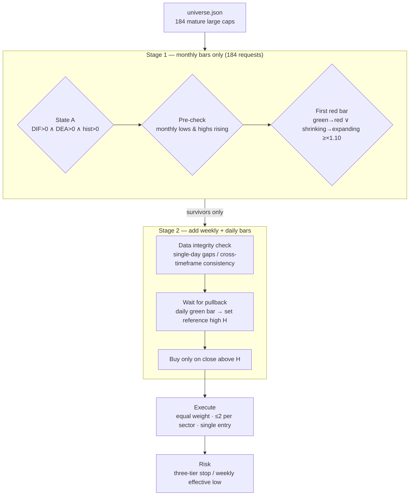

# holdle-screener

> A trend-following methodology — *pick well → wait well → manage well* — translated into
> executable, testable, reviewable code. Runs on an Alpaca paper account. **Zero gut feeling.**

⚠️ **DISCLAIMER: This is a rule-verification tool. It is NOT investment advice, and it is
NOT a profitable strategy. The author guarantees nothing. Please read "Known limitations"
before using it. Trading involves substantial risk of loss.**

---

## What it is

A monthly-signal / daily-trigger / rules-based-risk US-equity EOD trading system.

- **Pick well** — coarse screen over a 184-ticker pool of mature large caps (`universe.json`, 11 GICS sectors)
- **Wait well** — a three-gate entry: monthly **State A** + **structural pre-check** + **first red bar**, then wait for a breakout above the prior swing high
- **Manage well** — three-tier stop loss, weekly effective-low exit, ≤2 positions per sector, equal weight

What makes it different from yet another "golden cross bot":

| Property | Detail |
|---|---|
| **Rules decoupled from code** | Every parameter (MACD periods, thresholds, stop levels, lookbacks) lives in `config.json`. Change rules without touching code. |
| **Verifiable offline** | 141 assertions that need **no network and no API keys**. `python simtest.py` runs in seconds. Indicator math is cross-checked against external reference values. |
| **Failure modes handled explicitly** | Adjustment mismatch, delisted tickers with stale signals, corrupted data while holding a position, already-consumed entry opportunities — each has a dedicated gate and a regression test. |

## What it is NOT

- ❌ **Not a live-trading tool.** `TradingClient(paper=True)` is **hard-coded**. It is physically impossible to route an order to a live account.
- ❌ **Not a complete implementation.** The fundamental six-factor screen (ROE / gross margin / net margin / cash ratio / EPS) is **not implemented**. "Pick well" is approximated by a hand-curated pool of mature companies. This is the biggest gap.
- ❌ **No promise of beating the market.** SPY benchmark comparison is built in precisely so the system cannot fool itself.

---

## Quickstart

No API keys, no network — first confirm the logic is sound:

```bash
git clone https://github.com/<your-name>/holdle-screener.git
cd holdle-screener

# 1. Indicator & rule self-test (27 assertions, zero dependencies)
python rules.py

# 2. Offline end-to-end drill (70 assertions, includes a decision truth table)
python simtest.py

# 3. Screener logic self-test (28 assertions, zero dependencies)
python screen.py --selftest
```

Once all three are green, connect real data:

```bash
cp config.example.json config.json
python -m pip install -r requirements.txt

# Prints WHERE the keys were read from (never the keys themselves)
python alpaca_io.py

# Dry run: decisions and plans only — no orders, no config writes
python run.py scan

# Screen the broad universe (read-only)
python screen.py
```

---

## How it works



### Key concepts

| Concept | Definition |
|---|---|
| **State A** | Monthly MACD: `DIF > 0 ∧ DEA > 0 ∧ histogram > 0` (histogram = 2×(DIF−DEA)) |
| **Pre-check** | Monthly lows rising **and** monthly highs rising; a downtrending monthly chart is rejected outright |
| **First red bar** | Scenario 1 "green→red": last month's hist < 0, this month's > 0. Scenario 2 "shrinking→expanding": after months of contraction, this month's hist > last month's × 1.10 |
| **Entry gate** | `State A ∧ Pre-check ∧ First red bar` — all three required |
| **Reference high H** | From the next month on, switch to daily bars; wait for a pullback with a daily green bar; H is the **first** local high inside the entry window meeting all conditions |
| **Buy trigger** | Close > H. Void if not broken within **60 days** |
| **Three-tier stop** | Entry price P×0.80; once up >20% → P×0.90; once up >30% → P (breakeven). Then switch to the weekly effective-low rule |

### Code ↔ rule mapping

`rules.py` is the pure-function layer (zero dependencies, self-testable on its own);
`engine.py` is the orchestration layer.

| Code | Rule |
|---|---|
| `rules.is_state_a()` | State A |
| `rules.precheck()` | Monthly low/high rising |
| `rules.recent_first_red_bar()` | First red bar (both scenarios + ×1.10 threshold) |
| `rules.find_reference_high()` | Reference high H |
| `rules.stop_line()` | Three-tier stop loss |
| `rules.weekly_effective_low()` | Weekly effective low |
| `engine.decide()` | Decision truth table: ARM / BUY / CANCEL / SKIP / HOLD / SELL |
| `engine._sector_count()` / `_size_order()` | Sector cap / equal weight |
| `engine.analyze()` | Data integrity check + full analysis |

---

## Project layout

```
holdle-screener/
├── config.example.json    # Parameter template (copy to config.json)
├── universe.json          # 184-ticker broad universe, 11 GICS sectors
├── rules.py               # Pure functions: indicators + criteria (27 self-tests)
├── engine.py              # Main flow: scan → decide → execute → record
├── alpaca_io.py           # Alpaca data + paper trading wrapper (keys from env only)
├── screen.py              # Broad-universe screener (two-stage, 28 self-tests)
├── run.py                 # CLI entry point
├── report.py              # Performance report: return / benchmark / max drawdown
├── audit_h.py             # Reference-high H auditing tool
├── simtest.py             # Offline end-to-end drill (70 assertions)
├── verify_vs_reference.py # Indicator cross-check against reference values (16)
└── docs/
    └── methodology.md     # Full methodology write-up (Chinese)
```

### Runtime artifacts

| Path | Content |
|---|---|
| `ledger/YYYY-MM-DD.md` | Daily action log |
| `ledger/trades.jsonl` | Full action stream, one JSON per line (for post-mortems) |
| `state/portfolio.json` | Positions / pending entries / re-entry counters (the system's "memory") |
| `screens/YYYY-MM-DD.md` | Screener report |

---

## Testing

| Suite | Assertions | Needs network | Covers |
|---|---|---|---|
| `python rules.py` | 27 | ❌ | MACD convention, State A, pre-check, first red bar, stops, H window boundary |
| `python simtest.py` | 70 | ❌ | Decision truth table, full pipeline, state persistence, data integrity, report gate, benchmark & drawdown, consumed entries, H sourcing |
| `python screen.py --selftest` | 28 | ❌ | Screening consistency, deadline boundaries, delisting detection, watchlist safety, sector alignment |
| `python verify_vs_reference.py` | 16 | ✅ | Engine MACD / first-red-bar vs. external reference values |

**Why so much testing:** bugs in this class of system are mostly **silent** — no error, it
just stops working, or quietly buys one extra time. Without assertions you only notice that
"there are no signals anymore".

---

## Known limitations

Treat this as **work in progress**.

1. **Weekly effective low is an approximation.** The original rule is "pullback green weekly bar + subsequent new high → that low becomes the reference". The code approximates it with a swing-low window (3 weeks each side by default). A few percentage points of drift is possible in extreme conditions.
2. **Fills are approximated by the latest close.** No slippage, no spread, no pre/post market. **Paper results do not represent live results.**
3. **MACD needs warm-up.** EMAs need dozens of periods to converge. Default lookback is 60 monthly bars.
4. **Signal lookback is 4 months.** Monthly indicators update once a month; checking only the latest bar misses signals. Signals older than 4 months are not triggered.
5. **Sector classification is a static table.** Manually maintained; does not follow GICS changes.
6. **No fundamental screening** (biggest gap). The six financial factors are not implemented; "pick well" is approximated by a curated pool.
7. **Adjustment is the biggest data trap.** Alpaca returns **unadjusted** prices by default (`adjustment='raw'`). Real incidents: a 10:1 split made one ticker show a fake cliff "1922.91 → 301.49" and a histogram of −303 (true value +8.41); another ticker had an unadjusted weekly series alongside an adjusted monthly series — **same stock, two timeframes, two conventions**. The code now explicitly requests `Adjustment.ALL`, tags caches with the convention, and invalidates stale caches when it changes.
8. **Pre-check lookback is an interpretive choice.** Compares 3 complete months by default (current month ignored if incomplete).
9. **IEX data feed.** The free tier defaults to IEX; volume and extreme prices may differ from consolidated tape.
10. **Requires a machine that stays on** to run scheduled tasks.
11. **Taking the *first* qualifying high for H is an interpretive choice.** The source material only says "wait for price to spike, forming a short-term high H" — it does not specify first vs. highest. Change point is a single function.
12. **Parameters are calibrated, not optimized.** No parameter search was performed, and it is not recommended — monthly signals are rare and overfitting is meaningless.

---

## Design war stories

Possibly the most valuable part of this repository. **Every item below was hit for real and is locked down by a regression test.**

### 1. The silent no-op bug — reference high eaten by a window boundary

`find_reference_high()` used to start scanning for local highs at `start_idx + window`,
which effectively declared **"the first 5 bars of the entry window can never be the
reference high."**

But the spike most often happens right at the start of the month after the signal —
that is exactly where fresh money enters.

Consequence: for one ticker the window's highest point fell on bar 3, was permanently
skipped, and no later local high exceeded it. The system then displayed "waiting for a
spike" and **silently idled until the deadline**. No error, no action.

The fix truncates the comparison window at the left boundary, instead of mistaking the
**entry window's boundary** for the **data's boundary**:

```python
lo = max(start_idx, i - window)   # no longer requires i >= start_idx + window
hi = min(n, i + window + 1)
```

Verified afterwards against the methodology's own reference case: the engine's computed H
matched the documented value exactly.

### 2. Buying on a stale snapshot

`decide()` used to read `h_price` from state — a snapshot written on the day the signal was
armed. Any change to the algorithm or the data convention turns it into a stale value.

Consequence: with old H=109.56 and new H=110.69, a price landing between the two would make
the system **buy without a genuine breakout of the prior high**. No error, just one extra
silent buy.

The fix uses the value computed in the current run; state is only a fallback.

### 3. Beautiful signals from delisted tickers

An acquired delisted company's monthly bars stop at the delisting month, but the "last 4
bars" still contain a perfect first red bar. The screener cheerfully reports it as a buy
point while you stare at a ticker you cannot look up.

`is_stale()` exists to catch exactly this.

### 4. The already-consumed entry opportunity

The screener scans hundreds of tickers with a 4-month lookback, so it easily picks up names
that **already broke above H weeks ago and have since fallen back**. If the system still
waits for "a breakout above H", it is actually waiting for the **second** breakout — which
is not a valid entry in this methodology.

`h_broken_date` records whether the close ever exceeded H between H's formation and today.

**Why SKIP even when price is still above H:** we were not present on the breakout day, so
we **cannot know how far the move already went**. Price might be 1% above H, or it might have
run to +30% and come back to +1%. Buying in those two cases is completely different, and the
data cannot tell them apart. **Cannot distinguish → do nothing.**

### 5. Corrupted data must not trigger trades

Two integrity checks: single-day gap (±50%) and cross-timeframe consistency (5%). If either
fails, the ticker is **excluded from all decisions** this run.

The critical design choice: **corrupted data + a position that would trigger a stop → still
do not sell.** Better to stand still than to act wrongly; wait for the data to recover. This
is locked down by a dedicated test.

Gaps are judged on daily bars only, never monthly — a −39% monthly bar can be a *genuine*
gradual decline, and judging on monthly would kill real signals.

### 6. Reports must show the real criterion

A report column once showed "entry gate" based only on "has the signal month passed?", which
produced the misleading display "pre-check failed, but gate shows 🟢 open".

"Entering the entry period" is a temporal concept and **does not mean an entry is allowed**.
The report must use the real `gate_ok`. Locked down by a test.

---

## Roadmap

- [ ] **Fundamental screening layer** (biggest gap): wire up financial data, implement ROE / gross margin / net margin / cash ratio / EPS screening
- [ ] Exact weekly effective-low implementation (replacing the window approximation)
- [ ] A fuller backtesting framework (currently only cross-validation against reference values)
- [ ] Multi-market / multi-universe support
- [ ] Parameter sensitivity analysis (not optimization — checking whether results collapse when parameters move)

## Contributing

Issues and PRs are welcome. Especially:

- Pointing out **deviations** between the implementation and the source methodology (most valuable)
- Additional edge-case tests
- Data-source adapters (non-Alpaca market data)
- Documentation fixes

Before opening a PR, make sure `python rules.py && python simtest.py && python screen.py --selftest` is all green.

## License & attribution

Code released under the **MIT License**, see [LICENSE](LICENSE).

- Methodology source: the **HOLDLE public course**. Copyright belongs to its original author. This repository is an independent implementation, not affiliated with or endorsed by the original author.
- This repository contains **no** course material — only a code implementation of its rules and the engineering around it.

---

*For educational and rule-verification purposes only. Not investment advice. Markets carry risk; decide carefully.*
