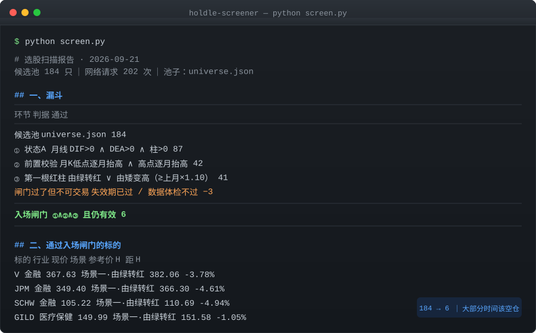
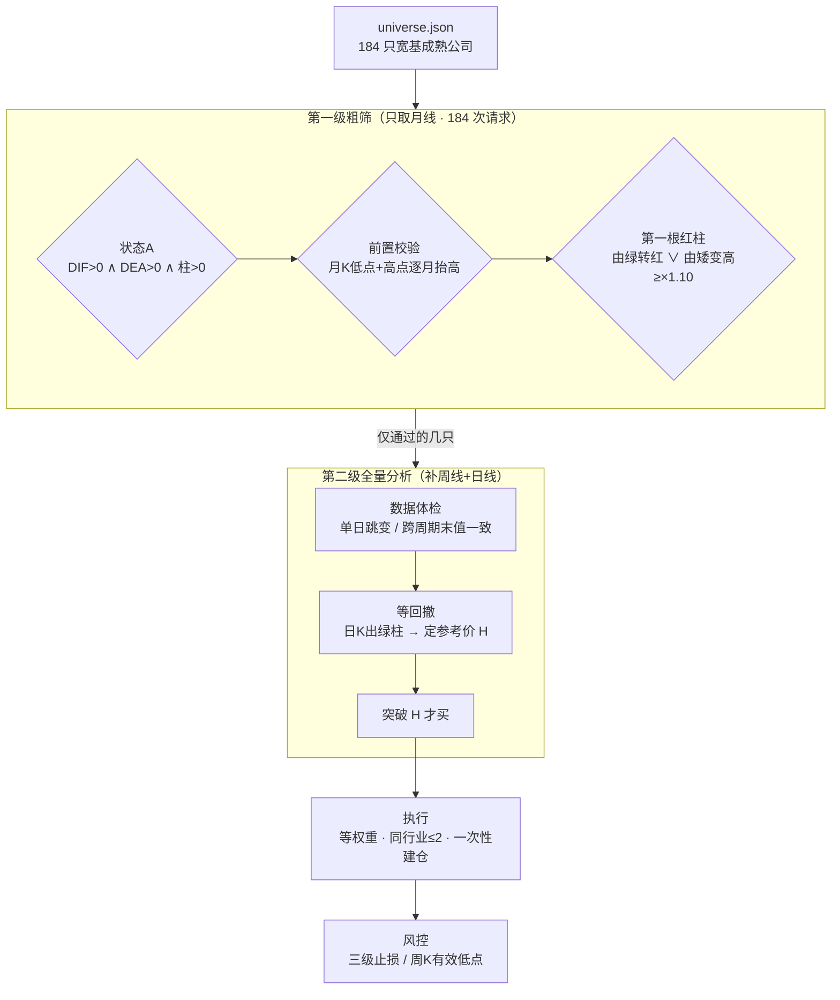

# holdle-screener

> 把「选好 → 等好 → 管好」这套趋势跟随方法论，翻译成可执行、可测试、可复盘的代码。
> 在 Alpaca 模拟盘上自动跑，**一行规则都不靠感觉**。

⚠️ **免责声明：本项目是规则验证工具，不是投资建议，也不是能赚钱的策略。**
**作者不保证任何收益。市场有风险，用它亏钱是你自己的事。请先读「已知限制」一节。**
**版权归属与商标说明见 [NOTICE.md](NOTICE.md)。**



---

## 30 秒了解

```bash
git clone <this-repo> && cd holdle-screener
python rules.py && python simtest.py && python screen.py --selftest
# → 27 通过 / 0 失败
# → 70 通过 / 0 失败
# → 28 通过 / 0 失败
```

不用密钥、不用联网。**先确认逻辑是通的，再谈接数据。**

---

## 这是什么

一套**月线定方向、日线找买点、规则管风险**的美股 EOD（收盘后）交易系统。

- **选好**：从 184 只宽基成熟公司池里粗筛（`universe.json`，11 个 GICS 行业）
- **等好**：月线 **状态A** + **前置校验** + **第一根红柱** 三重闸门，然后等突破前高
- **管好**：三级止损 + 周K有效低点离场 + 同行业 ≤2 只 + 等权重建仓

三个特点让它和「随便写个金叉策略」不一样：

| 特点 | 说明 |
|---|---|
| **规则与代码解耦** | 所有参数（MACD 周期、阈值、止损线、回看长度）都在 `config.json` 里。改规则不用改代码 |
| **离线可验证** | 141 项断言全部**不依赖网络和密钥**，`python simtest.py` 秒级跑完。指标实现有对拍校验（`verify_vs_reference.py`） |
| **失败模式被显式处理** | 复权口径不一致、退市票残留假信号、数据坏掉但持仓、入场机会已被消耗……这些坑都有专门的闸门和回归测试 |

## 这不是什么

- ❌ **不是实盘工具**。`TradingClient(paper=True)` 在代码里是**硬编码**的，物理上不可能误下单到实盘。
- ❌ **不是完整实现**。方法论里「基本面六维筛选」（ROE / 毛利率 / 净利率 / 现金占比 / EPS）**没有实现**，现在的「选好」是用一个人工挑出来的成熟公司池近似。这是最大的缺口。
- ❌ **不保证跑赢大盘**。系统里内置了 SPY 基准对比，就是为了不让自己骗自己。

---

## 快速开始

不需要密钥、不需要网络，先确认逻辑是通的：

```bash
git clone https://github.com/<your-name>/holdle-screener.git
cd holdle-screener

# ① 指标与规则自检（27 项，零依赖）
python rules.py

# ② 离线全链路演练（70 项断言，含决策真值表）
python simtest.py

# ③ 选股逻辑自检（28 项，零依赖）
python screen.py --selftest
```

三条全绿之后，再考虑连真实数据：

```bash
cp config.example.json config.json
python -m pip install -r requirements.txt

# 自检：打印密钥是从哪儿读到的（不打印密钥本身）
python alpaca_io.py

# 干跑一轮：出决策和计划，不下单、不写配置
python run.py scan

# 扫宽基池选股（只读）
python screen.py
```

<details>
<summary>真实输出长这样（点开看）</summary>

```
$ python simtest.py
── Part 1 · 决策真值表 ──
  ✅ 状态A + 前置校验 + 第一根红柱 → ARM（等待突破）
  ✅ 无信号 → 不动作
  ...
演练结果：70 通过 / 0 失败
```

```
$ python screen.py
# 选股扫描报告 · 2026-09-21

> 候选池 184 只 ｜ 网络请求 202 次 ｜ 体系：趋势跟随体系 ｜ 池子：`universe.json`

## 一、漏斗
| 环节 | 判据 | 通过 |
|---|---|---|
| 候选池 | `universe.json` | 184 |
| ① 状态A | 月线 DIF>0 ∧ DEA>0 ∧ 柱>0 | 87 |
| ② 前置校验 | 月K低点逐月抬高 ∧ 高点逐月抬高 | 42 |
| ③ 第一根红柱 | 由绿转红 ∨ 由矮变高（≥上月×1.10） | 41 |
| 闸门过了但不可交易 | 失效期已过 / 数据体检不过 | −3 |
| **入场闸门** | **①∧②∧③ 且仍有效** | **6** |
```

漏斗越往下越窄是正常的 —— **大部分时间本来就应该空仓**。

</details>

---

## 工作原理



### 判据速查

| 概念 | 定义 |
|---|---|
| **状态A** | 月线 MACD 的 `DIF > 0 ∧ DEA > 0 ∧ 柱 > 0`（柱 = 2×(DIF−DEA)，通达信口径） |
| **前置校验** | 月K低点逐月抬高 **且** 高点逐月抬高；月K向下直接放弃 |
| **第一根红柱** | 场景一「由绿转红」：上月柱<0 且本月柱>0；场景二「由矮变高」：连续多月递减后，本月柱 > 上月柱 × 1.10 |
| **入场闸门** | `状态A ∧ 前置校验 ∧ 第一根红柱`，三者同时成立 |
| **参考价 H** | 次月起切日K，等回撤出日K绿柱，取**入场窗口内第一个**满足「局部高点 + 有真回撤 + 回撤期间出绿柱」的高点 |
| **买点** | 收盘价突破 H。**60 天**不突破则本次作废 |
| **三级止损** | 入场价 P×0.80；涨超 20% → P×0.90；涨超 30% → P（保本）。之后切换周K有效低点规则 |

### 代码 ↔ 规则映射

`rules.py` 是纯函数层（零依赖、可单独跑自检），`engine.py` 是流程层。

| 代码 | 对应规则 |
|---|---|
| `rules.is_state_a()` | 状态A 判定 |
| `rules.precheck()` | 前置校验：月K低点+高点逐月抬高 |
| `rules.recent_first_red_bar()` | 第一根红柱（两个场景 + ×1.10 阈值） |
| `rules.find_reference_high()` | 参考价 H |
| `rules.stop_line()` | 三级止损 |
| `rules.weekly_effective_low()` | 周K有效低点 |
| `engine.decide()` | 决策真值表：ARM / BUY / CANCEL / SKIP / HOLD / SELL |
| `engine._sector_count()` / `_size_order()` | 同行业 ≤2 只 / 等权重 |
| `engine.analyze()` | 数据体检 + 全量分析 |

---

## 项目结构

```
holdle-screener/
├── config.example.json    # 参数模板（复制成 config.json 用）
├── universe.json          # 184 只宽基候选池，11 个 GICS 行业
├── rules.py               # 纯函数：指标 + 判据（零依赖，带 27 项自检）
├── engine.py              # 主流程：扫描 → 决策 → 执行 → 记账
├── alpaca_io.py           # Alpaca 行情 + 模拟盘封装（密钥只从环境变量读）
├── screen.py              # 宽基选股扫描器（两级，带 28 项自检）
├── run.py                 # 命令行入口
├── report.py              # 业绩报告：收益率 / 基准对比 / 最大回撤
├── audit_h.py             # 参考价 H 复核工具（出问题时靠它定位）
├── simtest.py             # 离线全链路演练（70 项断言）
├── verify_vs_reference.py # 指标对拍校验（16 项）
└── docs/
    └── methodology.md     # 方法论完整说明
```

### 运行产物

| 路径 | 内容 |
|---|---|
| `ledger/YYYY-MM-DD.md` | 当日操作记录 |
| `ledger/trades.jsonl` | 全部动作流水（一行一条 JSON，可做复盘） |
| `state/portfolio.json` | 持仓 / 等待入场 / 轮次计数（系统的"记忆"） |
| `screens/YYYY-MM-DD.md` | 选股扫描报告 |

---

## 配置

`config.json` 是**唯一需要改的地方**。改参数不要改代码。

```jsonc
{
  "mode": "dry",              // dry=只出计划 / paper=连模拟盘 / live=禁用
  "mandate": {
    "start": "2026-09-16",    // 自主交易授权区间
    "end":   "2026-10-16",
    "benchmark": "SPY"        // 用 SPY 而不是纳指，避免拿高波动基准给自己找台阶
  },
  "account": {
    "num_positions": 5,       // 总资金 ÷ 5 = 单只额度
    "same_sector_max": 2      // 同行业 ≤2 只
  },
  "rules": {
    "macd_fast": 12, "macd_slow": 26, "macd_signal": 9,
    "scenario2_multiplier": 1.1,        // 「由矮变高」阈值
    "breakout_deadline_days": 60,       // 不突破则作废
    "stop_loss_1": 0.8, "stop_loss_2": 0.9, "stop_loss_3": 1.0
  },
  "watchlist": []             // 留空即可，screen.py --apply 会写入
}
```

### 密钥配置

**任何文件里都不写密钥。** 只从环境变量读，并兜底查 Windows 用户级注册表：

```bash
setx ALPACA_API_KEY    "你的 Paper Key"
setx ALPACA_SECRET_KEY "你的 Paper Secret"
# 重开终端后生效
python alpaca_io.py   # 只打印来源，不打印密钥
```

> 为什么要两层兜底：`setx` 写的是注册表，只有**在它之后启动**的进程才继承得到。
> 定时任务若由更早启动的常驻父进程拉起，就读不到 —— 结果是每天**静默失败、一笔都不交易**。

---

## 测试

| 套件 | 断言数 | 需要网络 | 覆盖什么 |
|---|---|---|---|
| `python rules.py` | 27 | ❌ | MACD 口径、状态A、前置校验、第一根红柱、三级止损、参考价 H 的窗口边界 |
| `python simtest.py` | 70 | ❌ | 决策真值表、全链路、状态持久化、数据体检、报表闸门、基准与回撤、入场机会消耗、参考价取数 |
| `python screen.py --selftest` | 28 | ❌ | 粗筛一致性、失效期边界、退市检测、观察池安全约束、行业标签对齐 |
| `python verify_vs_reference.py` | 16 | ✅ | 引擎算出的 MACD / 第一根红柱是否与外部参照值一致 |

**为什么这么在意测试**：这类系统的 bug 大多是**静默的** —— 不报错，只是不干活，或者悄悄多买一次。
不写断言，你只会觉得"怎么没信号"。

---

## 已知限制

请当成**未完成品**看。

1. **周K有效低点是近似实现**。原版是「回撤出周K绿柱 + 随后创新高 → 该低点成为参考价」，代码用摆动低点窗口法（默认左右各 3 周）近似。极端行情下可能有几个百分点偏差。
2. **成交价用最新收盘价近似**。没有滑点、点差、盘前盘后。**模拟盘结果不代表实盘。**
3. **MACD 需要预热**。EMA 要几十期才收敛。默认回溯 60 个月月线。
4. **信号回溯窗口 4 个月**。月线每月才更新，只判最新一根会漏信号；但超过 4 个月的旧信号不触发。
5. **行业分类是静态表**。写在配置里，需手工维护，不会自动跟随 GICS 调整。
6. **不含基本面筛选**（最大的缺口）。六维财务指标未实现，「选好」靠人工挑的成熟公司池近似。
7. **复权口径是最大的数据坑**。Alpaca 默认返回**不复权价**（`adjustment='raw'`）。实测踩过：KLAC 因 10:1 拆股出现「1922.91 → 301.49」假断崖，算出的柱是 −303（真实值 +8.41）；AVGO 周线未复权、月线已复权，**同一只股票两个周期两个口径**。现在显式请求 `Adjustment.ALL`，缓存带口径标记，口径一变旧缓存自动作废。
8. **前置校验回看长度是解释性选择**。默认比较 3 个完整月（当月未走完则忽略）。这个取值经过一次校准 —— 更严的取值会与既有结论冲突。
9. **IEX 数据源**。免费档默认走 IEX feed，成交量与极端价可能与交易所口径有差。
10. **需要本机常开**才能跑定时任务。
11. **参考价 H 取「窗口内第一个」是解释性选择**。方法论原文只说「等待价格冲高，形成短期高点 H」，没规定取第一个还是最高的那个。当前实现取**第一个**满足条件的。若认为应取窗口内最高点，改动点只有 `rules.find_reference_high()` 一处。
12. **参数是校准过的，不是优化过的**。没有做任何参数寻优，也不建议做 —— 月线级别信号本来就少，过拟合毫无意义。

---

## 设计上踩过的坑

这一节可能是仓库里最有价值的部分。**都是真实踩过、有回归测试锁住的。**

### 1. 静默空转型 bug —— 参考价被窗口边界吃掉

`find_reference_high()` 原本从 `start_idx + window` 开始找局部高点，等于规定**入场窗口内最早 5 根K线永远不能当参考价**。

但「冲高」恰恰最可能发生在 T+1 月刚开头那几天 —— 那本来就是资金刚进场的位置。

后果：某只票窗口内最高点落在第 3 根，被永久跳过；后面又没有更高的局部高点，于是它一路显示「等待冲高」，**静默空转到失效日**。不报错、也不干活。

修复是把比较窗口在左边界处截断，而不是把**入场窗口的边界**当成**数据的边界**：

```python
lo = max(start_idx, i - window)   # 不再要求 i >= start_idx + window
hi = min(n, i + window + 1)
```

修完用方法论自己的参照案例验证：引擎算出的 H 与文档记载**一字不差**。

### 2. 用旧快照做买入判定

`decide()` 原来读 state 里存的 `h_price` —— 那是 ARM 那天写进去的快照。只要算法或数据口径一变，它就变成旧值。

后果：某只票旧 H=109.56 / 新 H=110.69，股价落在两者之间时，系统会**在没真正突破前高时买入**。不报错，只是悄悄多买一次。

现在一律用本轮当场算出的值，state 只作兜底。

### 3. 退市票的「漂亮信号」

被收购退市的股票，月K停在退市那个月，但「最近 4 根柱体」里还留着一个完美的第一根红柱。扫描器会兴冲冲把它报成买点，而你对着一个查不到的代码发呆。

`is_stale()` 就是挡这个的。

### 4. 入场机会「已消耗」

扫描器一次捞几百只、回溯 4 个月，很容易捞到**几周前就已经突破过 H、现在又跌回来**的标的。此时系统若还傻等「突破 H」，等的其实是**第二次突破** —— 那不是体系里的买点。

用 `h_broken_date` 记录「H 之后到今天之前，收盘价是否站上过 H」。

**为什么「现价仍在 H 上方」也要 SKIP**：突破那天我们不在场，就**无法判断突破之后已经走了多远** —— 现价可能只比 H 高 1%，也可能先冲到 +30% 再回到 +1%。这两种情形买进去完全是两回事，而数据里看不出区别。**分不清 → 不做。**

### 5. 坏数据不该触发交易

数据体检有两项：日K单日跳变（±50%）、跨周期末值一致（5%）。任一项不过 → 该标的本次**完全不参与判定**。

关键设计：**坏数据 + 持仓触发止损 → 仍然不卖。** 宁可不动，不可乱动，等数据恢复再判。这条有专门测试锁住。

只用日K判跳变、不用月K —— 因为月线 −39% 可能是**真实的逐步下跌**，拿月线判会把真行情误杀。

### 6. 报表显示的判据必须是真实判据

扫描表曾有一列「入场闸门」只看「信号月是否已过」，于是出现过「前置校验不通过、表格却显示 🟢 已开」的误导。

「进入入场期」是时间概念，**不等于可以入场**。报表必须用真实的 `gate_ok`。测试锁住。

---

## 路线图

- [ ] **基本面筛选层**（最大缺口）：接入财务数据，实现 ROE / 毛利率 / 净利率 / 现金占比 / EPS 六维筛选
- [ ] 周K有效低点的精确实现（替换现在的窗口近似）
- [ ] 更完整的回测框架（现在只有对拍校验，没有长周期历史回测）
- [ ] 多市场 / 多标的池支持
- [ ] 参数敏感度分析（不是寻优，是看参数变了结果会不会崩）

## 贡献

欢迎提 Issue 和 PR。特别欢迎这几类：

- 指出规则实现与方法论原文的**偏差**（这是最有价值的）
- 补充边界情形的测试用例
- 数据源适配（非 Alpaca 的行情源）
- 文档纠错

提 PR 前请确保 `python rules.py && python simtest.py && python screen.py --selftest` 全绿。

## 许可与致谢

代码以 **MIT License** 发布，见 [LICENSE](LICENSE)。
版权、归属、商标与免责的完整说明见 **[NOTICE.md](NOTICE.md)** —— **二次分发前请读一遍。**

- **方法论来源**：HOLDLE 的公开课程内容。该方法论及其表述的版权归原作者所有。
- **本项目是独立实现**：与原作者**无关联、无合作、未获其授权或背书**。仓库名中的方法论名称仅用于**指明规则出处**。
- **不含课程材料**：本仓库不包含任何课程原文、讲义、课件、影音或付费内容。文档只描述「代码实现了什么」，不复述课程内容。
- **规则 ≠ 表达**：版权保护具体表达（文字、图表、影音），不保护思想与方法本身。本项目实现的是规则逻辑，并用自有文字描述。
- **权利人可以叫停**：如果权利人认为本仓库的名称或内容超出了合理引用范围，提 Issue 即可，我们会配合改名或移除相关内容。

---

*本工具仅供学习与规则验证，不构成投资建议。市场有风险，决策需谨慎。*
