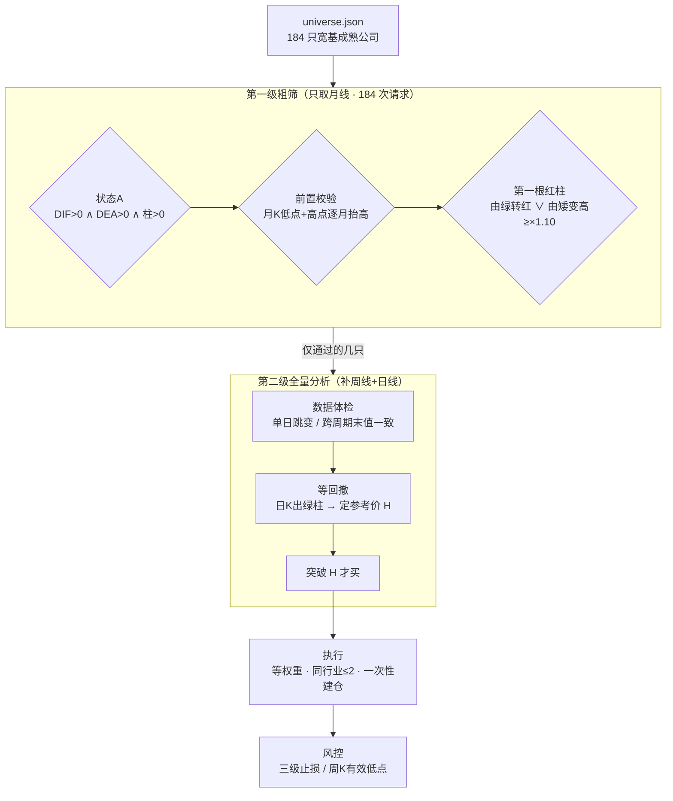

# holdle-screener

把「选好 → 等好 → 管好」这套趋势跟随方法论，写成能跑、能测、能复盘的代码。跑在 Alpaca 模拟盘上。

先说清楚：这是个规则验证工具，不是投资建议，也不是什么能赚钱的策略。我不保证任何收益。请先看下面的「已知限制」再决定要不要用。


---

## 30 秒了解

```bash
git clone git@github.com:Simen-Chen/holdle-screener.git
cd holdle-screener
python rules.py && python simtest.py && python screen.py --selftest
# → 27 通过 / 0 失败
# → 70 通过 / 0 失败
# → 28 通过 / 0 失败
```

不用密钥，不用联网。先确认逻辑是通的，再谈接数据的事。

---

## 这是个什么东西

一套收盘后跑的美股交易系统。月线定方向，日线找买点，剩下的交给规则。

选股这一层，从 184 只宽基成熟公司里粗筛，池子在 `universe.json`，按 11 个 GICS 行业分组。

时机这一层是三重闸门：月线的状态A，加一个月K结构的前置校验，再加「第一根红柱」。三个同时成立才进入下一步，然后等突破前高。

风控这一层是三级止损、周K有效低点离场，加上同行业不超过 2 只、等权重、一次性建仓。

有三个地方我觉得比「随便写个金叉策略」要值：

规则和代码是分开的。MACD 周期、各种阈值、止损线、回看长度，全在 `config.json` 里。想改规则改配置就行，不用碰代码。

测试不用联网。141 项断言，`python simtest.py` 几秒跑完。指标的算法还跟外部参照值做过对拍，确认算出来的 MACD 跟别人一致。

失败模式是显式处理的。复权口径不一致、退市股票留下的假信号、数据坏了但手上有仓位、入场机会已经被消耗过，这些都有专门的闸门和回归测试盯着。下面会讲。

## 这不是什么东西

不是实盘工具。`TradingClient(paper=True)` 在代码里是写死的，物理上不可能把单子下到实盘去。

不是完整实现。方法论里「基本面六维筛选」（ROE、毛利率、净利率、现金占比、EPS）我没做。现在的选股是靠一个人工挑出来的成熟公司池近似，不是靠财务指标算出来的。这是最大的缺口。

也不保证跑赢大盘。系统里内置了 SPY 基准对比，就是为了不让自己骗自己。

---

## 快速开始

不需要密钥和网络，先跑这三条确认逻辑是通的：

```bash
git clone git@github.com:Simen-Chen/holdle-screener.git
cd holdle-screener

# 指标与规则自检，27 项，零依赖
python rules.py

# 离线全链路演练，70 项断言，含决策真值表
python simtest.py

# 选股逻辑自检，28 项，零依赖
python screen.py --selftest
```

三条都绿了，再考虑连真实数据：

```bash
cp config.example.json config.json
python -m pip install -r requirements.txt

# 打印密钥是从哪儿读到的，不打印密钥本身
python alpaca_io.py

# 干跑一轮，出决策和计划，不下单、不写配置
python run.py scan

# 扫宽基池选股，只读
python screen.py
```

<details>
<summary>真实输出长这样</summary>

```
$ python simtest.py
── Part 1 · 决策真值表 ──
  ✅ 状态A + 前置校验 + 第一根红柱 → ARM（等待突破）
  ✅ 无信号 → 不动作
  ...
演练结果：70 通过 / 0 失败
```

```
$ python screen.py
# 选股扫描报告 · 2026-09-21

> 候选池 184 只 ｜ 网络请求 202 次 ｜ 趋势跟随体系 ｜ 池子：`universe.json`

## 一、漏斗
| 环节 | 判据 | 通过 |
|---|---|---|
| 候选池 | `universe.json` | 184 |
| ① 状态A | 月线 DIF>0 ∧ DEA>0 ∧ 柱>0 | 87 |
| ② 前置校验 | 月K低点逐月抬高 ∧ 高点逐月抬高 | 42 |
| ③ 第一根红柱 | 由绿转红 ∨ 由矮变高（≥上月×1.10） | 41 |
| 闸门过了但不可交易 | 失效期已过 / 数据体检不过 | −3 |
| 入场闸门 | ①∧②∧③ 且仍有效 | 6 |
```

漏斗越往下越窄是正常的。月线级别的信号本来就少，大部分时间本来就应该空仓。

</details>

---

## 怎么跑的



### 几个关键概念

| 概念 | 定义 |
|---|---|
| 状态A | 月线 MACD 的 `DIF > 0 ∧ DEA > 0 ∧ 柱 > 0`（柱 = 2×(DIF−DEA)，通达信口径） |
| 前置校验 | 月K低点逐月抬高，且高点逐月抬高。月K向下就直接放弃 |
| 第一根红柱 | 场景一「由绿转红」是上月柱<0 且本月柱>0；场景二「由矮变高」是连续多月递减后，本月柱 > 上月柱 × 1.10 |
| 入场闸门 | 状态A、前置校验、第一根红柱，三个同时成立 |
| 参考价 H | 次月起切日K，等回撤出日K绿柱，取入场窗口内第一个满足「局部高点 + 有真回撤 + 回撤期间出绿柱」的高点 |
| 买点 | 收盘价突破 H。60 天不突破，这次入场就作废 |
| 三级止损 | 入场价 P×0.80；涨超 20% 提到 P×0.90；涨超 30% 提到 P（保本）。之后切周K有效低点规则 |

### 代码和规则的对应

`rules.py` 是纯函数层，零依赖，可以单独跑自检。`engine.py` 是流程层。

| 代码 | 对应规则 |
|---|---|
| `rules.is_state_a()` | 状态A |
| `rules.precheck()` | 月K低点+高点逐月抬高 |
| `rules.recent_first_red_bar()` | 第一根红柱，两个场景加 ×1.10 阈值 |
| `rules.find_reference_high()` | 参考价 H |
| `rules.stop_line()` | 三级止损 |
| `rules.weekly_effective_low()` | 周K有效低点 |
| `engine.decide()` | 决策真值表：ARM / BUY / CANCEL / SKIP / HOLD / SELL |
| `engine._sector_count()` / `_size_order()` | 同行业 ≤2 只 / 等权重 |
| `engine.analyze()` | 数据体检 + 全量分析 |

---

## 文件都在哪

```
holdle-screener/
├── config.example.json    参数模板，复制成 config.json 用
├── universe.json          184 只宽基候选池，11 个 GICS 行业
├── rules.py               纯函数：指标和判据，零依赖，带 27 项自检
├── engine.py              主流程：扫描 → 决策 → 执行 → 记账
├── alpaca_io.py           Alpaca 行情和模拟盘封装，密钥只从环境变量读
├── screen.py              宽基选股扫描器，两级，带 28 项自检
├── run.py                 命令行入口
├── report.py              业绩报告：收益率 / 基准对比 / 最大回撤
├── audit_h.py             参考价 H 复核工具，出问题时靠它定位
├── simtest.py             离线全链路演练，70 项断言
├── verify_vs_reference.py 指标对拍校验，16 项
└── docs/
    └── methodology.md     方法论完整说明
```

跑起来会生成这些东西：

| 路径 | 内容 |
|---|---|
| `ledger/YYYY-MM-DD.md` | 当日操作记录 |
| `ledger/trades.jsonl` | 全部动作流水，一行一条 JSON，可以拿来做复盘 |
| `state/portfolio.json` | 持仓、等待入场、轮次计数，相当于系统的记忆 |
| `screens/YYYY-MM-DD.md` | 选股扫描报告 |

---

## 配置

`config.json` 是唯一需要改的地方。改参数不要改代码。

```jsonc
{
  "mode": "dry",              // dry=只出计划 / paper=连模拟盘 / live=禁用
  "mandate": {
    "start": "2026-09-16",    // 自主交易授权区间
    "end":   "2026-10-16",
    "benchmark": "SPY"        // 用 SPY 而不是纳指，避免拿高波动基准给自己找台阶
  },
  "account": {
    "num_positions": 5,       // 总资金 ÷ 5 = 单只额度
    "same_sector_max": 2      // 同行业 ≤2 只
  },
  "rules": {
    "macd_fast": 12, "macd_slow": 26, "macd_signal": 9,
    "scenario2_multiplier": 1.1,        // 「由矮变高」阈值
    "breakout_deadline_days": 60,       // 不突破则作废
    "stop_loss_1": 0.8, "stop_loss_2": 0.9, "stop_loss_3": 1.0
  },
  "watchlist": []             // 留空即可，screen.py --apply 会写入
}
```

### 密钥怎么配

任何文件里都不写密钥。只从环境变量读，读不到再去 Windows 用户级注册表兜一层。

```bash
setx ALPACA_API_KEY    "你的 Paper Key"
setx ALPACA_SECRET_KEY "你的 Paper Secret"
# 重开终端后生效
python alpaca_io.py   # 只打印来源，不打印密钥
```

为什么要兜两层：`setx` 写的是注册表，只有在它之后启动的进程才继承得到。定时任务如果是由更早启动的常驻父进程拉起来的，就读不到，结果是每天静默失败、一笔都不交易。这个我实际踩过。

---

## 测试

| 套件 | 断言数 | 要联网吗 | 覆盖什么 |
|---|---|---|---|
| `python rules.py` | 27 | 不要 | MACD 口径、状态A、前置校验、第一根红柱、三级止损、参考价 H 的窗口边界 |
| `python simtest.py` | 70 | 不要 | 决策真值表、全链路、状态持久化、数据体检、报表闸门、基准与回撤、入场机会消耗、参考价取数 |
| `python screen.py --selftest` | 28 | 不要 | 粗筛一致性、失效期边界、退市检测、观察池安全约束、行业标签对齐 |
| `python verify_vs_reference.py` | 16 | 要 | 引擎算出的 MACD 和第一根红柱，跟外部参照值是否一致 |

为什么在这上面花这么多力气：这类系统的 bug 大多是静默的。不报错，只是不干活，或者悄悄多买一次。不写断言，你只会觉得「怎么没信号了」。

---

## 已知限制

当成未完成品看。

1. 周K有效低点是近似实现。原版是「回撤出周K绿柱 + 随后创新高 → 该低点成为参考价」，代码用摆动低点窗口法（默认左右各 3 周）近似。极端行情下可能有几个百分点偏差。
2. 成交价用最新收盘价近似。没有滑点、点差、盘前盘后。模拟盘结果不代表实盘。
3. MACD 需要预热。EMA 要几十期才收敛。默认回溯 60 个月月线。
4. 信号回溯窗口 4 个月。月线每月才更新，只判最新一根会漏信号；但超过 4 个月的旧信号不触发。
5. 行业分类是静态表。写在配置里，要手工维护，不会自动跟随 GICS 调整。
6. 不含基本面筛选，这是最大的缺口。六维财务指标没实现，选股靠人工挑的成熟公司池近似。
7. 复权口径是最大的数据坑。Alpaca 默认返回不复权价（`adjustment='raw'`）。我实际踩过：KLAC 因为 10:1 拆股，月K出现「1922.91 → 301.49」的假断崖，算出来的柱是 −303，真实值其实是 +8.41；AVGO 的周线还是未复权，月线已经复权，同一只股票两个周期两个口径。现在显式请求 `Adjustment.ALL`，缓存带口径标记，口径一变旧缓存自动作废。
8. 前置校验的回看长度是个解释性选择。默认比较 3 个完整月，当月没走完就忽略。这个取值经过一次校准，取更严的话会跟既有结论冲突。
9. IEX 数据源。免费档默认走 IEX feed，成交量和极端价可能跟交易所口径有差。
10. 需要本机常开才能跑定时任务。
11. 参考价 H 取「窗口内第一个」也是解释性选择。方法论原文只说「等待价格冲高，形成短期高点 H」，没规定取第一个还是最高的那个。当前实现取第一个满足条件的。如果认为该取窗口内最高点，改动点只有 `rules.find_reference_high()` 一处。
12. 参数是校准过的，不是优化过的。我没做参数寻优，也不建议做。月线级别信号本来就少，过拟合毫无意义。

---

## 设计上踩过的坑

我觉得这是整个仓库里最有价值的部分。都是真踩过、并且有回归测试锁住的。

### 静默空转型 bug：参考价被窗口边界吃掉

`find_reference_high()` 原本从 `start_idx + window` 开始找局部高点，等于规定入场窗口内最早 5 根K线永远不能当参考价。

但「冲高」恰恰最可能发生在 T+1 月刚开头那几天。那本来就是资金刚进场的位置。

后果是，某只票窗口内的最高点落在第 3 根，被永久跳过；后面又没有更高的局部高点，于是它一路显示「等待冲高」，静默空转到失效日。不报错，也不干活。

修法是把比较窗口在左边界处截断，而不是把入场窗口的边界当成数据的边界：

```python
lo = max(start_idx, i - window)   # 不再要求 i >= start_idx + window
hi = min(n, i + window + 1)
```

修完用方法论自己的参照案例验证过，引擎算出的 H 跟文档记载一字不差。

### 用旧快照做买入判定

`decide()` 原来读 state 里存的 `h_price`，那是 ARM 那天写进去的快照。只要算法或者数据口径一变，它就变成旧值。

后果：某只票旧 H=109.56，新 H=110.69，股价落在两者之间时，系统会在没真正突破前高的时候买入。不报错，只是悄悄多买一次。

现在一律用本轮当场算出的值，state 里的只作兜底。

### 退市票的漂亮信号

被收购退市的股票，月K停在退市那个月，但「最近 4 根柱体」里还留着一个完美的第一根红柱。扫描器会兴冲冲把它报成买点，而你对着一个查不到的代码发呆。

`is_stale()` 就是挡这个的。

### 入场机会已经消耗掉了

扫描器一次捞几百只、回溯 4 个月，很容易捞到几周前就已经突破过 H、现在又跌回来的标的。这时候系统如果还傻等「突破 H」，等的其实是第二次突破，那不是这套体系里的买点。

用 `h_broken_date` 记录 H 之后到今天之前，收盘价有没有站上过 H。

为什么现价还在 H 上方也要 SKIP：突破那天我们不在场，就没法判断突破之后已经走了多远。现价可能只比 H 高 1%，也可能先冲到 +30% 再回到 +1%。这两种情形买进去完全是两回事，而数据里看不出区别。分不清就不做。

### 坏数据不该触发交易

数据体检有两项：日K单日跳变（±50%）、跨周期末值一致（5%）。任一项不过，该标的这次就完全不参与判定。

有个关键设计：坏数据加上持仓触发止损，仍然不卖。宁可不动，不可乱动，等数据恢复再判。这条有专门的测试锁着。

跳变只用日K判，不用月K。因为月线 −39% 可能是真实的逐步下跌，拿月线判会把真行情误杀。

### 报表显示的判据必须是真实判据

扫描表曾经有一列「入场闸门」只看「信号月是否已过」，于是出现过「前置校验不通过、表格却显示已开」的误导。

「进入入场期」是时间概念，不等于可以入场。报表必须用真实的 `gate_ok`。这条也有测试锁着。

---

## 后面想做的

- 基本面筛选层，也就是最大的那个缺口。接财务数据，把 ROE、毛利率、净利率、现金占比、EPS 这几个维度做出来
- 周K有效低点的精确实现，替换现在的窗口近似
- 更完整的回测框架。现在只有对拍校验，没有长周期历史回测
- 多市场、多标的池
- 参数敏感度分析。不是寻优，是看参数动了结果会不会崩

## 想一起弄

Issue 和 PR 都欢迎。最想要的是这几种：

- 指出实现和方法论原文的偏差。这个最有价值
- 补边界情形的测试用例
- 接非 Alpaca 的行情源
- 文档纠错

提 PR 之前，先确保 `python rules.py && python simtest.py && python screen.py --selftest` 是全绿的。

## 许可

代码走 MIT，见 [LICENSE](LICENSE)。版权、归属、商标和免责的完整说明在 [NOTICE.md](NOTICE.md)，二次分发前建议读一遍。

方法论来源是 HOLDLE 的公开课程内容，版权归原作者。这个仓库是独立实现，跟原作者没有关联、没有合作、也没拿到授权或背书。仓库名里的名称只用来指明规则出处。仓库里不含任何课程原文、讲义、课件或影音。

如果权利人认为名称或者内容超出了合理引用的范围，提个 Issue 就行，我会配合改名或者移除。

---

*仅供学习和规则验证，不构成投资建议。市场有风险，决策需谨慎。*
